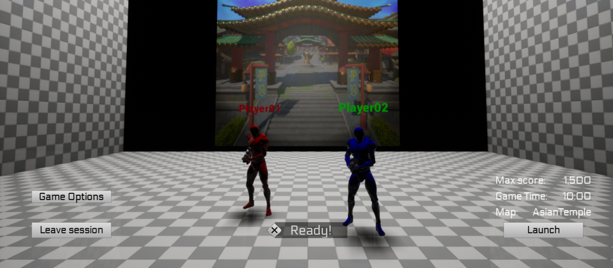
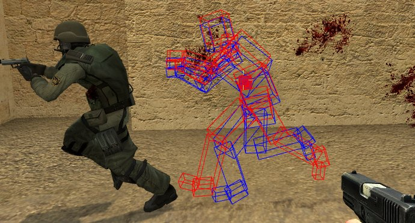
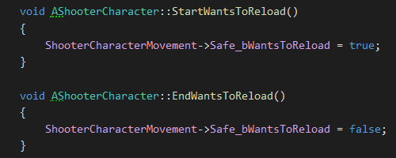
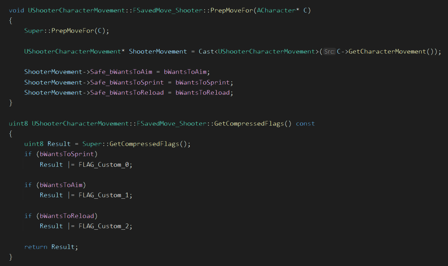
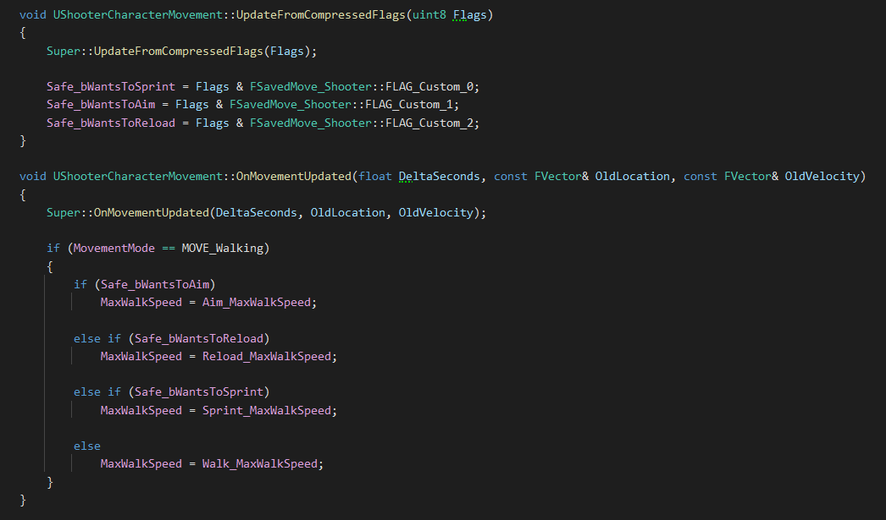
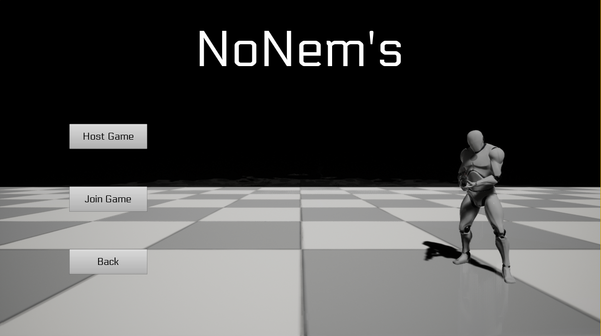
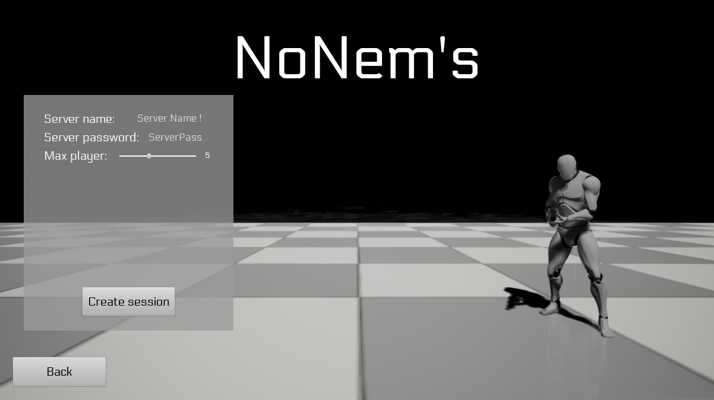
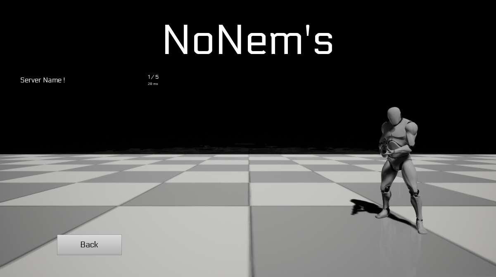
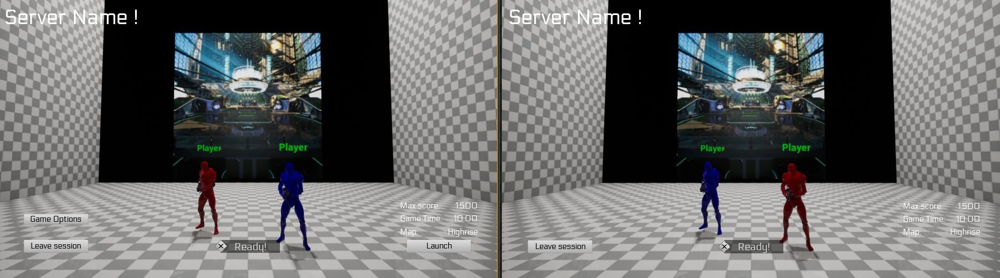

# *NoNem's*: *Online Multiplayer Third person shooter* - **Unreal Engine/C++**
### ISART DIGITAL GP3, School Project: *Lancelot MARÉCHAL, Sasha LEGRAND, Rémi GINER*  

 

<!-- ABOUT THE PROJECT -->
# About The Project 
**Built with Unreal Engine 4.27.2**

The goal of the project is to make a Third Person Shooter playable in online multiplayer on UE4.27. The project must be done using the ShooterMulti template provided.

# Table of contents
1. [Features & usage](#features--usage)
    - [Features](#features)
    - [Controls](#controls)
3. [How to launch](#how-to-launch)
5. [Details](#details)
    - [Gameplay replication](#gameplay-replication)
5. [Reference](#references)
6. [Versionning](#versionning)
6. [Autors](#authors)

# Features & usage

## Features
- Advanced sessions system
- Lag compensation
- Actions and movements prediction

## Controls
The controls are made for keyboard only:
- WASD - Move your character
- Mouse movements - Move your camera
- Left click - Shoot
- Right click - Aim
- R - Reload
- Punch - F
- Push button - E

# How to launch
Launch the StartClient.bat directly from the archive.

# Details

## Gameplay replication 
To make the initial game playable in online multiplayer, we had to make some changes.

### **Lag compensation**
We wanted to implement client prediction when a player shoots. To do this 
we decided to take inspiration from the valve model: [The lag compensation system](https://developer.valvesoftware.com/wiki/Lag_Compensation.)

The Lag Compensation runs pretty simply: On the server side, at each frame of the game, the Lag Compensation saves a **SavedFrame** which contains a **timestamp**  and each **colliders** of the level with their respective **transform state**.

When a client asks the Lag Compensation System to replay a frame, it sends an RPC with its *ServerTimeStamp*. When the Server receives the RPC, it gets the correct **SavedFrame** bound to the **timestamp** and sets each **colliders** to their respective **transform state**.

To avoid memory overflow, the Lag Compensation System cleans its frames when they are too old (On the current state of the game, each frame older than 0.5sec or 500ms is deleted).

### **Character movement**
To use Unreal Engine at its best. We took the decision to implement the different states that modify the CharacterMovement (such as Reload, Aim and Sprint) as MovementModes. We have implemented these states as the Crouching state from the native CharacterMovement.

When a client presses the Reload Key, its says to the Client-side CharacterMovement that they wants to reload.

Then the client sends CompressedFlags to the server.

Finally the server receives the client request and treats it.

## Lobby Room
To allow the player to create its own game session or join a friend session, we decided to use the *Advanced Session* plugin.

### **Session preparation**
Everything starts here. You have the choice to create your game by clicking the "*Host Game*" button or join an existing one by clicking the "*Join Game*" button.

If you want to create your game session, you will end up with this window where you can set your server properties (name, password, max players)

If you want to join an existing game session, you will end up with this window where all the sessions will be listed. Simply click on the session you want to join.

> **Note:** If the server ask for a password, a window will pop up. We first made the password check on the server for security but this requires the player to have aleady join the session (player is not connected to a server before the session). For a better control, we decided to move the check on the client side (not secure). The solution to avoid that will be to have a main server driving the other server.

When you join or create a session, you fall in a *Lobby Room* where you can select your team and see the other players of the session. The game master (the one who created the session) can also tweak some parameters like the max score, the max time and the game map. He can also launch the game at any time (only if all the players are set to "*Ready*")

## References:
- https://developer.valvesoftware.com/wiki/Lag_Compensation
- https://docs.unrealengine.com/5.1/en-US/API/Runtime/Engine/GameFramework/ACharacter/
- https://docs.unrealengine.com/4.27/en-US/InteractiveExperiences/Networking/CharacterMovementComponent/

## Versionning
Perforce for the versioning.

# Authors
* **Lancelot MARÉCHAL**
* **Sasha LEGRAND**
* **Rémi GINER**