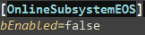

# *NoNem's*: *Online Multiplayer Third person shooter* - **Unreal Engine/C++**
### ISART DIGITAL GP3, School Project: *Lancelot MARÉCHAL, Sasha LEGRAND, Rémi GINER*  

 

<!-- ABOUT THE PROJECT -->
# About The Project 
**Built with Unreal Engine 4.27.2**

The goal of the project is to make a Third Person Shooter playable in online multiplayer on UE4.27. The project must be done using the ShooterMulti template provided.

# Table of contents
1. [Launching](#launching)
2. [Known issues](#known-issues) 
3. [Features & usage](#features--usage)
    - [Features](#features)
    - [Controls](#controls)
4. [How to launch](#how-to-launch)
5. [Details](#details)
    - [Gameplay replication](#gameplay-replication)
    - [Server Creation](#server)
    - [Sessions & lobby](#lobby-room)
5. [Reference](#references)
6. [Versioning](#versioning)
6. [Authors](#authors)

# Launching
To launch the project open with Unreal Engine version 4.27.
Generate the solution from the *ShooterMulti.uproject*, launch the project. From the engine compile C++.
After that, to launch the game in an optimal way, since there is no packaged version, launch from the StartClient.bat.

## Known issues
Sometimes server crashes after restarting the game. We couldn't figure out when and what caused it.\
Sometimes the player camera stays in aiming state after player stop aiming and needs player to aim again to fix it.\

# Features & usage

## Features
- Advanced sessions system
- Lag compensation
- Actions and movements prediction

## Controls
The controls are made for keyboard only:
- WASD - Move your character
- Mouse movements - Move your camera
- Left click - Shoot
- Right click - Aim
- R - Reload
- Punch - F
- Push button - E

# How to launch
Launch the StartClient.bat directly from the archive.

# Details

## Gameplay replication 
To make the initial game playable in online multiplayer, we had to make some changes.

### **Lag compensation**
We wanted to implement client prediction when a player shoots. To do this 
we decided to take inspiration from the valve model: [The lag compensation system](https://developer.valvesoftware.com/wiki/Lag_Compensation.)

The Lag Compensation runs pretty simply: On the server side, at each frame of the game, the Lag Compensation saves a **SavedFrame** which contains a **timestamp**  and each **colliders** of the level with their respective **transform state**.

When a client asks the Lag Compensation System to replay a frame, it sends an RPC with its *ServerTimeStamp*. When the Server receives the RPC, it gets the correct **SavedFrame** bound to the **timestamp** and sets each **colliders** to their respective **transform state**.

To avoid memory overflow, the Lag Compensation System cleans its frames when they are too old (On the current state of the game, each frame older than 0.5sec or 500ms is deleted).

### **Character movement**
To use Unreal Engine at its best. We took the decision to implement the different states that modify the CharacterMovement (such as Reload, Aim and Sprint) as MovementModes. We have implemented these states as the Crouching state from the native CharacterMovement.

When a client presses the Reload Key, its says to the Client-side CharacterMovement that they wants to reload.

Then the client sends CompressedFlags to the server.

Finally the server receives the client request and treats it.

## Server
We decided that it was more user-friendly if the user can launch their **dedicated** server directly from the game.\
However, they can still launch it on it's own with the appropriate .bat

To this end, and to also have a simple way of transmitting the config, we decided to create a config.ini file.\
For this we use a Struct and a Json-to-struct converter integrated to unreal. So even though the file is a .ini, the content is formated as a .json.
Allowing us to easily save and load the struct without creating our own parsing.

The config is set by the client in the main menu are saved before launching the server.\
Afterwards, the server reads the config from the .ini to launch the session.

Launching the server independently from the .bat will also load the config.ini.

We planned on packaging the game as a client version and a server version.\
However, building the server requires to rebuild Unreal from the GitHub version because the EpicGames Launcher Version doesn't allow us to package with the target Server.\
Since, it was too long to compile. We decided not to do it. But the client build couldn't launch the server without it.
So we did neither.

> **Note:** A config file for a server is often seen when the server are hosted on personal computers. But if we wanted to have the server created and hosted remotely we would need an other way to transfer the config.\
But creating the session remotely would already require to be connected to a server which then could transfer the config.\
So this is the same solution as the one to the problem in the next section.

### EOS
We tried and implemented the Epic Online System and were faced with a few troubles.
- The online subsystem API for EOS does not provide a full interfacing of the EOS SDK, thus some functionalities aren't usable.
- With the limited API, it seems that it is only possible to launch listen servers and no dedicated.
- If the EOS is enabled launching a dedicated server is impossible so we can't just let the user choose to use it or not in game.
- We didn't have time to test the final game with EOS enabled and some issues might occur due to that.

To bypass these issues, we implemented a function that detects if the EOS is enabled or not.\
This function is used in some places such as the creation or join of the session.\
We can then decide to enable or disable the EOS in the **Config/DefaultEngine.ini** by changing the boolean to true or false:\
 \
If the game was packaged, this would mean creating two packages.

Overall this implementation was more of a trial and a proof of concept than a real feature and even if it can be tested to some extent it may not work in the final state of the game.

## Lobby Room
To allow the player to create its own game session or join a friend session, we decided to use the *Advanced Session* plugin.

### **Session preparation**
Everything starts here. You have the choice to create your game by clicking the "*Host Game*" button or join an existing one by clicking the "*Join Game*" button.

If you want to create your game session, you will end up with this window where you can set your server properties (name, password, max players)

If you want to join an existing game session, you will end up with this window where all the sessions will be listed. Simply click on the session you want to join.

> **Note:** If the server ask for a password, a window will pop up. We first made the password check on the server for security but this requires the player to have already join the session (player is not connected to a server before the session). For a better control, we decided to move the check on the client side (not secure). The solution to avoid that will be to have a main server driving the other server.

When you join or create a session, you fall in a *Lobby Room* where you can select your team and see the other players of the session. The game master (the one who created the session) can also tweak some parameters like the max score, the max time and the game map. He can also launch the game at any time (only if all the players are set to "*Ready*")

## References:
- https://developer.valvesoftware.com/wiki/Lag_Compensation
- https://docs.unrealengine.com/5.1/en-US/API/Runtime/Engine/GameFramework/ACharacter/
- https://docs.unrealengine.com/4.27/en-US/InteractiveExperiences/Networking/CharacterMovementComponent/

## Versioning
Perforce for the versioning.

# Authors
* **Lancelot MARÉCHAL**
* **Sasha LEGRAND**
* **Rémi GINER**